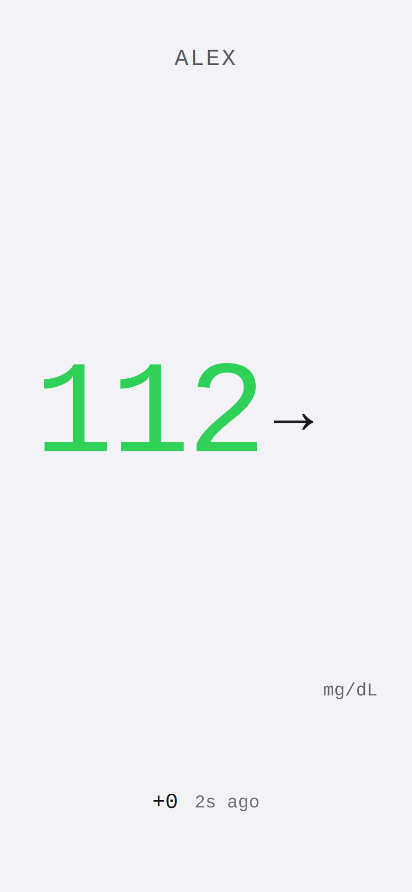

<!-- authoring-audit: 2026-07-16 BLUF,ModePurity,ConceptBudget,Examples,Terminology -->

# Clock View

The Clock View is a full-screen, real-time glucose display served by upstream
[`gluco-hub-rs`](https://github.com/micschr0/gluco-hub-rs) (`clock.html`, baked into the upstream binary).
This add-on only wires HA Ingress (`ingress: true`, `ingress_port: 8080`) so the Clock View appears in the
Home Assistant sidebar. The `clock.html` file in this repository is a source-of-record reference copy and is
**not** copied into the Docker image — the upstream binary serves its own bundled version.

## Access

Open the Clock View from the Home Assistant sidebar — the add-on's Ingress panel serves it directly.
Access is admin-only by default (as configured in `config.yaml`).

Direct URL (via Ingress proxy): the sidebar panel opens `clock.html` relative to the Ingress root.
Query parameters can be appended to tailor the display — see [Query parameters](#query-parameters) below.

Example URL with common parameters:
```
?preset=phone&unit=mmol&lo=70&hi=180
```

## Query parameters

All parameters are optional. They are read from the URL query string on page load and merged with any
server-embedded config (`window.CLOCK_CONFIG`) and `localStorage` values.

| Parameter | Accepted values | Effect |
|-----------|----------------|--------|
| `unit` | `mgdl` (default) \| `mmol` | Display unit for glucose readings. |
| `lo` | Number (mg/dL) | Low threshold. Values below this are shown in the low zone (default 70). |
| `hi` | Number (mg/dL) | High threshold. Values above this are shown in the high zone (default 180). |
| `eink` | Presence flag | Enables e-ink mode (same as `preset=eink`). Applied before first paint to avoid flash. |
| `preset` | `eink` \| `wall` \| `phone` \| `small` \| `watch` | Forces a specific layout, overriding auto-detection. `preset=eink` also activates e-ink mode. |
| `kiosk` | Presence flag | Enables kiosk mode: lengthens the long-press needed to open settings to 3 s and, when `pin` is set, gates settings behind a PIN prompt. The reading is shown immediately on load. |
| `pin` | Digits string | The PIN required to open settings via long-press in kiosk mode (e.g. `?kiosk&pin=1234`). |
| `dark` | `0` \| `1` | Force light (`0`) or dark (`1`) theme. Absence defers to `prefers-color-scheme`. |

Parameter priority (highest to lowest): URL param → `localStorage` → server-embedded config → built-in default.

## Layouts

The Clock View automatically selects a layout class based on the viewport dimensions. The `preset` parameter
overrides auto-detection.

Conditions are evaluated in this order; the first match wins, and `phone` is the fallback when none match:

| Layout class | Auto-detection condition | Typical device |
|---|---|---|
| `watch` | Short side < 200 px | Smartwatch / tiny display |
| `small` | Short side < 400 px | Small phone or compact widget |
| `wall` | Long side > 900 px | Landscape monitor / wall display / TV |
| `phone` | Fallback (no other condition matched) | Phone, tablet, browser window |

`?preset=eink` activates e-ink mode (see below) instead of a viewport-based layout.

When `?preset=` is set to `wall`, `phone`, `small`, or `watch`, it forces that layout regardless of the actual
viewport — useful for embedding in iframes or dashboard cards of a fixed size.

## E-ink mode

Activated by `?eink` (presence flag) or `?preset=eink`. Both are equivalent.

Behaviour:
- The e-ink preset is applied **before first paint** to prevent a theme flash.
- SSE updates are debounced (500 ms) to avoid rapid screen refreshes on slow e-ink panels.
- A visible border is drawn around the display when the reading is in the LOW or HYPO zone, providing a high-contrast
  at-a-glance visual indicator that works on monochrome screens.

## Kiosk mode

Activated by `?kiosk` (presence flag). Optionally combined with `?pin=<digits>`.

- The reading is shown immediately on load — kiosk mode does **not** hide it behind an overlay.
- Kiosk mode lengthens the long-press that opens the settings panel from 600 ms to **3 seconds**, so a casual
  touch on a wall display does not open settings.
- With `?pin=<digits>` set, the 3-second long-press shows a **PIN prompt** instead of settings; settings open only
  after the correct PIN is entered (e.g. `?kiosk&pin=4321`).
- Without a `pin`, the 3-second long-press opens settings directly — no PIN prompt is shown.
- Tapping the display in kiosk mode does not open the detail/sparkline overlay — that tap gesture is disabled in kiosk mode.

> [!NOTE]
> Kiosk mode is a display lock only, not an authentication layer — Home Assistant Ingress already authenticates the session before the page is served.

## Data

The Clock View pulls live glucose data from three endpoints served by `gluco-hub-rs`:

| Endpoint | Protocol | Purpose |
|---|---|---|
| `/clock/state` | HTTP GET (JSON) | Initial snapshot — polled once on page load to populate the display immediately |
| `/clock/events` | SSE (`EventSource`) | Live push stream — delivers `reading` and `keepalive` events as they arrive |
| `/clock/history` | HTTP GET (JSON array) | Seed data — up to 3 h of `{ ts, mgdl }` history for the trend graph |

See [HTTP Status API](status-api.md) for the route signatures and response shapes.

## Screenshot

The screenshot below was captured headless from `clock.html` with mock data (phone layout, mgdl, in-range,
patient "Alex").



*Clock View — rendered with mock data (not a live reading)*

---

> ⚠️ **Not affiliated with Abbott Laboratories.** Unofficial research and self-hosting tool. Use may violate Abbott's LibreLink Up Terms of Service. No warranty. Not for medical decisions, therapy, dosing, or diagnosis.

LibreLink, LibreView, FreeStyle Libre, Libre 2, and Libre 3 are trademarks of Abbott.
